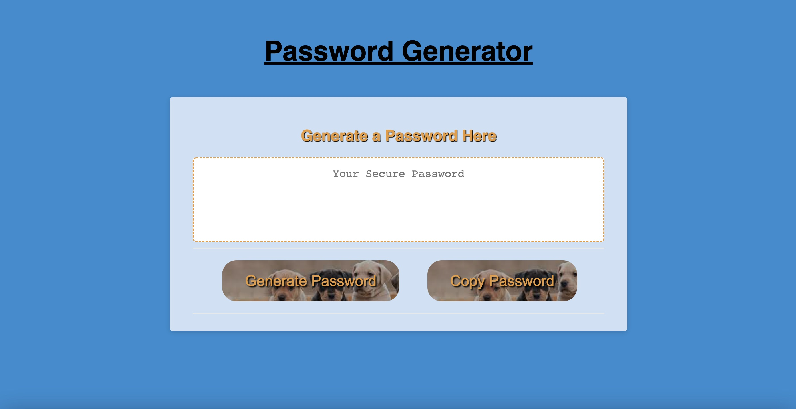

# <Password-Generator>

## Password Generator

## Table of Contents

- [Description](#description)
- [Installation](#installation)
- [User Story](#user-story)
- [Acceptance Criteria](#acceptance-criteria)
- [Mock Up](#mock-up)
- [Submission](#submission)
- [Credits](#credits)
- [License](#license)

## Description

<ul>
<li>
The motivation for this project was to create an easy UI platform where users can generate a random password with specified perameters (special characters, uppercase letters, lowercase letters, and/ or numbers). 
</li>
<li>
The goal here was to make a nice looking page with very simple prompts, easy-to-read styling, and ease of use for the end-user.
</li>
<li>
This code can be modified to meet other perameters, but the main constants are that the password must be between 8 and 128 characters AND contain at least one of the specified criteria for the actual characters generated. 
</li>
<li>
It is an excellent baseline for providing non-bias and completely randomly generated passwords that will not be easy to replicate or guess!
</li>
</ul>

## Installation

<ol>
<li>
In order to begin this project, we must first have a code viewer - such as Visual Studio Code (VSCode).
</li>
<li>
Since we are relying heavily on the javascript here, it is important that we have the appropriate html code with proper IDs and classes labelled so that our javascript can funtion properly in use and in console.  
</li>
<li>
Periodically making sure the project's updates and changes look correct in a live broswer is very important as well. Having a browser open to see the updates happening in live-time will allow you to receive a visual feedback to tell what needs to be done next - outside of solely relying on what the code looks like.
</li>
</ol>

## USER STORY

AS AN employee with access to sensitive data

I WANT to randomly generate a password that meets certain criteria

SO THAT I can create a strong password that provides greater security

## ACCEPTANCE CRITERIA

GIVEN I need a new, secure password

WHEN I click the button to generate a password

THEN I am presented with a series of prompts for password criteria

WHEN prompted for password criteria

THEN I select which criteria to include in the password

WHEN prompted for the length of the password

THEN I choose a length of at least 8 characters and no more than 128 characters

WHEN asked for character types to include in the password

THEN I confirm whether or not to include lowercase, uppercase, numeric, and/or special characters

WHEN I answer each prompt

THEN my input should be validated and at least one character type should be selected

WHEN all prompts are answered

THEN a password is generated that matches the selected criteria

WHEN the password is generated

THEN the password is either displayed in an alert or written to the page

## MOCK UP

## SUBMISSION

The fully-deployed website for this password generator can be found through the following GitHub Pages link:

https://shahidhashmi1.github.io/Password-Generator/

The associated html code, css stylesheet, and javascript for this assignment can be found at the following GitHub repository link:

https://github.com/ShahidHashmi1/Password-Generator

## Credits

The collaborators on this project included my tutor, Sabrina Hanson, and my TA, Michael Kotte.

The resources for this vary across different platforms. I used explored various methods of populating an empty array where the user-selected criteria would fit, but ultimately landed on concatenation as the methodology. A few resources for implementing and concatenating arrays were [Javascript Plain English][2], [W3 Schools][3], and [Stack Overflow][5].

Some other things I had referenced, were different methods of utilizing a copy button so that the end-user may grab the password and copy to their clipboard for further use elsewhere. The references used are for this, and other concepts such as for loops - were places like [W3 Schools][1], [Youtube][4], [Stack Overflow][6], [MDN][7], [Code Grepper][8], [Dev To][9], and [Codepen][10].

[1]: https://www.w3schools.com/js/js_loop_for.asp "W3 Schools"
[2]: https://javascript.plainenglish.io/three-ways-to-merge-arrays-in-javascript-27cef85fe67b "Javascript Plain English"
[3]: https://www.w3schools.com/jsref/jsref_concat_array.asp "W3 Schools"
[4]: https://www.youtube.com/watch?v=NHg6jQajaMs "Youtube"
[5]: https://stackoverflow.com/questions/1288095/append-to-string-variable "Stack Overflow"
[6]: https://stackoverflow.blog/2019/09/12/practical-ways-to-write-better-javascript/ "Stack Overflow"
[7]: https://developer.mozilla.org/en-US/docs/Web/API/Element/copy_event "MDN"
[8]: https://www.codegrepper.com/code-examples/javascript/copy+button+html "Code Grepper"
[9]: https://dev.to/michaelburrows/copy-text-to-the-system-clipboard-on-click-with-javascript-1c0k "Dev To"
[10]: https://codepen.io/shaikmaqsood/pen/XmydxJ "Codepen"

If this text is not readable, please refer to the GitHub repository link I have provided above that will outline the exact URLs for these references.

## License

There are no licensing requirements.
